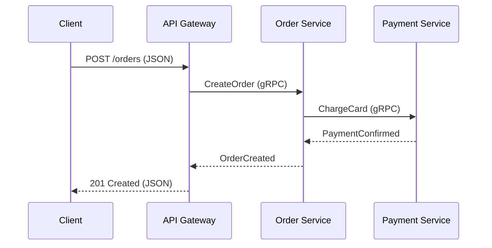
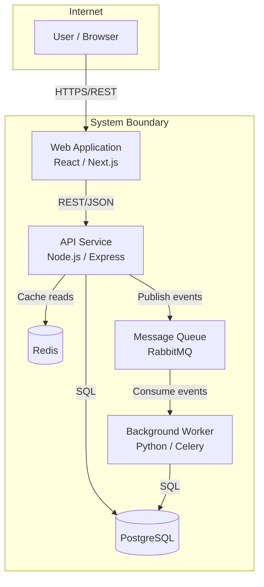
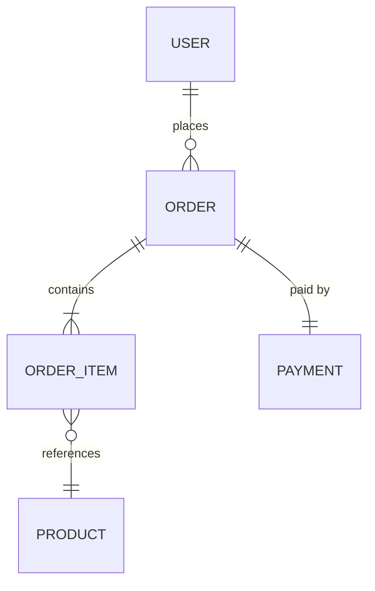
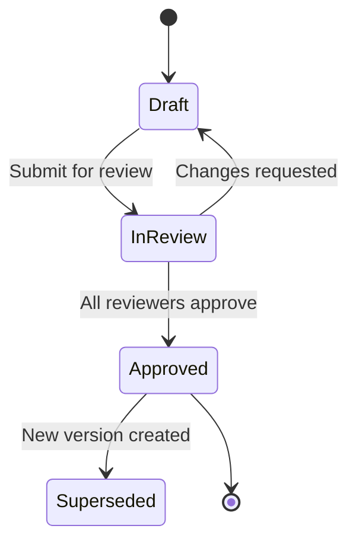

# Diagram Standards

Use the appropriate diagram type for the content being communicated. Diagrams should clarify what prose alone cannot: spatial relationships, data flow, component interactions, and system boundaries.

## Diagram Decision Framework

| What You're Showing | Diagram Type | Recommended Tool |
|---------------------|-------------|-----------------|
| System boundaries, external actors, high-level context | C4 Context Diagram | Mermaid, Structurizr, draw.io |
| Internal components and their relationships | C4 Container or Component Diagram | Mermaid, Structurizr, draw.io |
| Multi-step API or service interactions | Sequence Diagram | Mermaid |
| Data entities and relationships | Entity-Relationship (ER) Diagram | Mermaid, dbdiagram.io |
| State transitions or workflow stages | State Machine / Flowchart | Mermaid |
| Infrastructure and deployment topology | Deployment Diagram | draw.io, Excalidraw, Lucidchart |
| Decision logic with multiple branches | Decision Table or Flowchart | Markdown table, Mermaid |
| Time-sequenced project milestones | Gantt Chart | Mermaid |
| Data pipeline or ETL flow | Data Flow Diagram | Mermaid, draw.io |

## Universal Diagram Rules

**Every diagram must have a title and a brief caption** explaining what it shows. The caption should answer: "What should the reader learn from this diagram?"

**Label all arrows and connections** with the protocol, data format, or action. Unlabeled arrows are ambiguous and generate questions during review.
- Good: `REST/JSON`, `async/Kafka`, `reads from`, `gRPC`, `mTLS`
- Bad: Unlabeled arrow between two boxes

**Provide descriptive alt text** for accessibility. The alt text should describe the diagram's content and purpose, not just "architecture diagram."

**Keep diagrams focused.** If a diagram has more than 12 nodes, split it into multiple diagrams at different abstraction levels. Use the C4 model's layered approach: Context → Container → Component → Code.

**Prefer Mermaid for version-controlled diagrams.** Mermaid diagrams are defined in code, live in the repository, and are rendered by most markdown viewers (GitHub, GitLab, Notion, Confluence). This makes them maintainable and diffable.

**Link to external tools for complex diagrams.** For infrastructure topology or complex architecture views that exceed Mermaid's capabilities, use draw.io, Lucidchart, or Excalidraw and link to the source file from the document.

## Mermaid Quick Reference

### Sequence Diagram

### C4 Container Diagram (using Mermaid flowchart)

### Entity-Relationship Diagram

### State Machine

## When NOT to Use Diagrams

Not everything benefits from a diagram. Skip diagrams when:

- The content is a simple list of items (use a table instead)
- The relationship is purely hierarchical with no interactions (use a heading structure)
- You're duplicating information that's already clear from the prose
- The diagram would have fewer than 3 nodes (describe it in a sentence instead)

A good rule: if you catch yourself thinking "this would be clearer with a picture," add a diagram. If you're adding a diagram because the template says to, reconsider.
